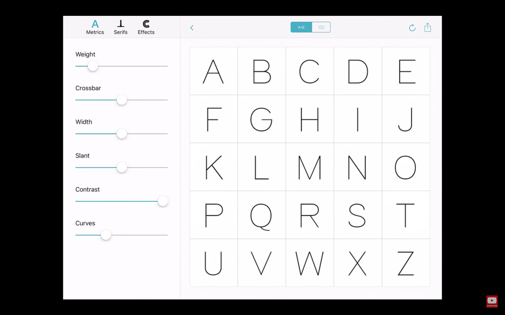
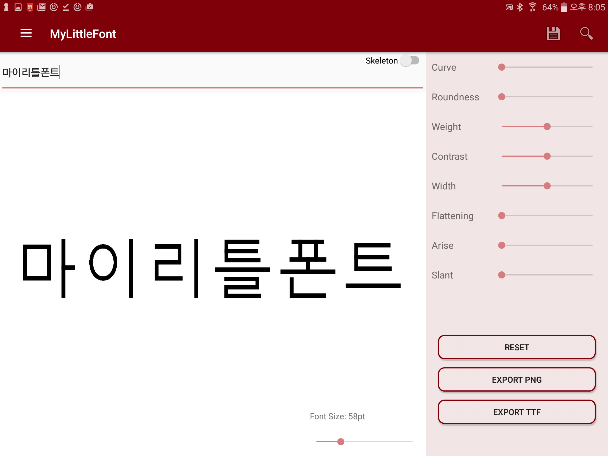
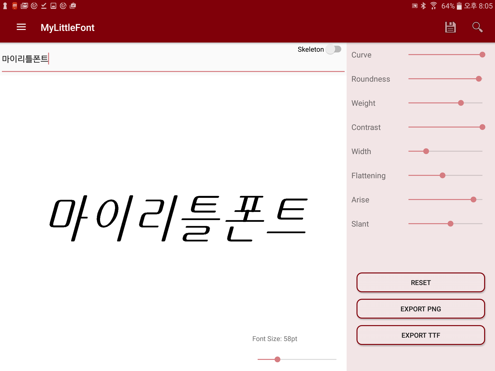

# **My Little Font**

**An easy, simple, and user-friendly Android application for both experts and non-experts which generates Hangul font.**

[](https://github.com/MyLittleFont/MyLittleFont/tree/develop) [](http://www.oracle.com/technetwork/java/index.html) [](https://developer.android.com/about/versions/marshmallow/android-6.0.html) [](https://mylittlefont.github.io/MyLittleFont)

## Overview
Fonts are very important for deciding the mood of printed outcomes. Same letters have different atmospheres depends on the font type. However, making customized font which perfectly fit into users' preference needs lots of efforts. For instance, making a single Hangul font takes at least 6 months in general. To generate the Hangul font, we need to manually draw at least 2,150 letters, and also it is difficult to draw the font without professional knowledge about typography. We tackled this issue and decided to make a Hangul font generating tool named **MyLittleFont**. Using **MyLittleFont**, users can easily generate Hangul fonts in short time even if they are not font expertises.

## Motivation

Problem of making font is not just for Hangul but also Alphabet. However, there are two famous projects which provide easy way to customize fonts. First, Adobe's [Project Faces](https://www.youtube.com/watch?v=bcUo9ULvVq4) was presented in [Adobe MAX 2015](http://2015.max.adobe.com). **Project Faces** has made predefined features about fonts, and controlling slide-bars can customize fonts as users like.

Second, [Prototypo](https://www.prototypo.io) web page gives similar solution with *Project Faces* but with different features to customize. Unlike *Faces*, *Prototypo* is on service. From both two project, we decided to develop similar service but targets Hangul fonts.

**Screenshot of Project Faces**



**Screenshot of Prototypo**


## Objective and Goal
Our goal is to build a Hangul font generator which allows customize fonts in short time and easily. **MyLittleFont** contains predefined features (such as curve, roundness, weight, contrast, width, slant, flattening, arrise, and more) which are controllable by users through slidebars. For instance, if an user wants more rounded and wider font, simply moving the roundness and the width slidebar will satisfy the user. Moreover, using **MyLittleFont** needs no professional knowledge about typography. We believe these characteristics of the project will solve hardness of customizing font.

**Screenshot of Changing features (prototype)**



## How to Run
1. Download [DefaultSkeleton.json](https://drive.google.com/file/d/0B4j1ARhzxseyYVZLUUJjb082THM/view?usp=sharing)

2. Push to your android device

```shell
adb push {src_directory}/DefaultSkeleton.json storage/emulated/0/Download/MyLittleFont/DefaultSkeleton.json
```
3. Build application and run.

## Documentation

See https://mylittlefont.github.io/MyLittleFont

## Contributing

To contribute the project, see [CONTRIBUTING](CONTRIBUTING.md).
